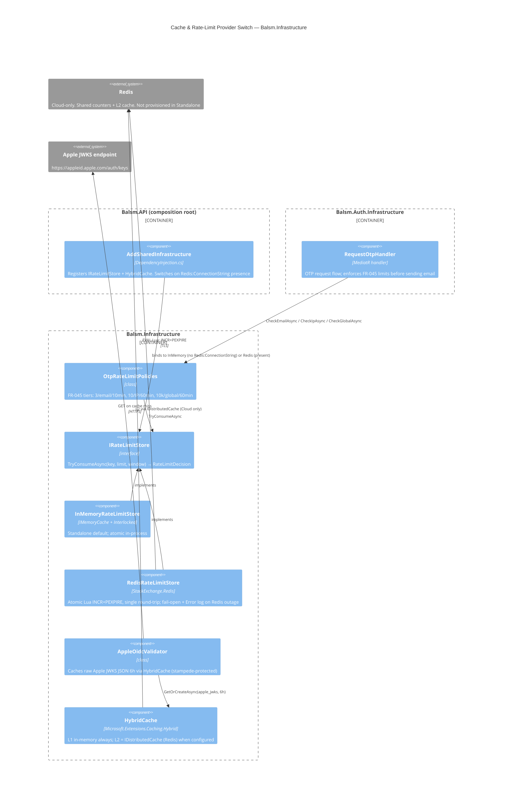

# C4 Level 3 — Component: Cache & Rate-Limit Provider Switch

Scope: `Balsm.Infrastructure` cross-cutting plumbing. Introduces `IRateLimitStore` so the
OTP rate limiter (FR-045a/b/c) is atomic and shared across replicas in Cloud (Redis) while
Standalone keeps a zero-dependency in-process store. Apple JWKS caching moves to
`HybridCache` (L1 in-memory always; L2 Redis when configured). Selection key:
`Redis:ConnectionString` — present ⇒ Redis-backed, absent ⇒ in-memory (Standalone never sets it).

Deliberately **not** migrated (per-node state is correct for them):

- `StatusHealthJob` / `StatusController` — each pod reports its own DB liveness (`IMemoryCache`).
- Supervisor `RateLimitMiddleware` — Supervisor is Standalone-only, never multi-node.

Layer rules respected: everything lives in `Balsm.Infrastructure` (host plumbing), no module
project references touched; `RequestOtpHandler` (Auth.Infrastructure) already depended on
`OtpRateLimitPolicies` — only the call shape changes (sync → async).
