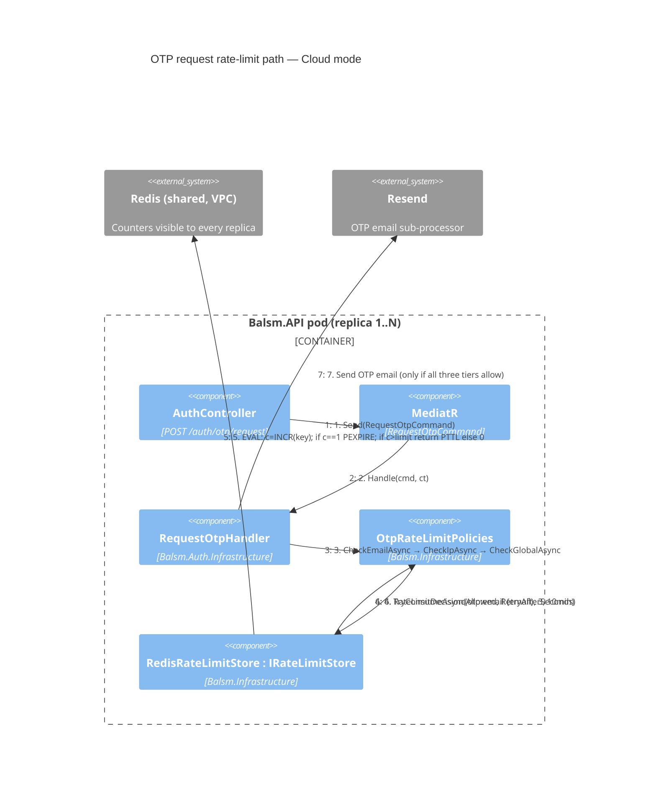

# C4 Level 4 — Dynamic: OTP Rate-Limit Check (Cloud, Redis-backed)

Flow for `POST /auth/otp/request` (FR-045). Cloud runs N replicas; counters must be shared
and atomic — a plain get/set cache would let concurrent requests on different pods slip past
the limit (read-modify-write race). Redis Lua script performs INCR + PEXPIRE + limit check
in one atomic server-side step.

**Trust boundary & auth:** Redis is inside the Cloud VPC (Railway private network),
reached with connection-string auth over TLS. Rate-limit keys carry no PHI —
`otp:email:{email}` contains the account email (non-PHI cloud data per P001) with a
bounded TTL; nothing else is stored.

**Failure mode — fail-open:** if Redis is unreachable, `RedisRateLimitStore` logs `Error`
and **allows** the request. Rationale: OTP send is defense-in-depth (account lockout still
guards verification); blocking every login on a Redis blip is worse for a healthcare app
than briefly losing spray protection. `AbortOnConnectFail=false` so the multiplexer
reconnects in the background.

Rejected tier ⇒ `OtpRateLimitException(retryAfter, tier)` ⇒ HTTP 429 + `Retry-After`
(unchanged contract — no endpoint, DTO, or Insomnia/OpenAPI change in this refactor).

Standalone mode: identical sequence with `InMemoryRateLimitStore` at step 4–6
(Interlocked increment on an `IMemoryCache` entry — atomic in-process, no network).
