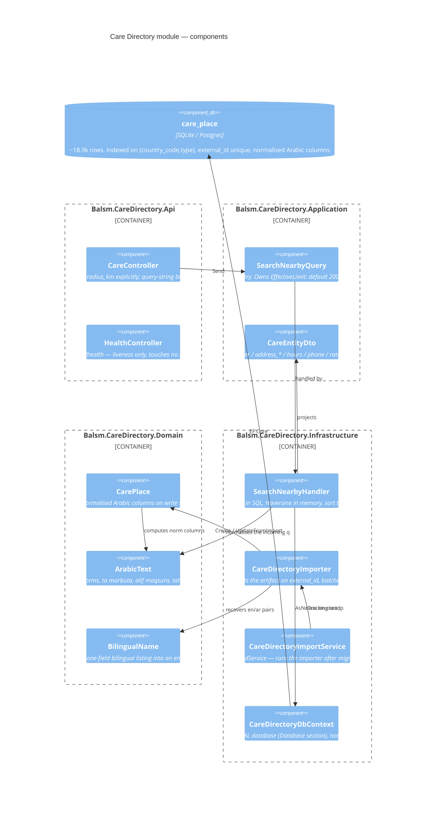

# Care Directory — Level 3: Component

## Layering

`Api → Application → Domain` and `Infrastructure → Domain`, as the module rules
require. The handler lives in `Infrastructure` rather than `Application` because
it touches a DbContext — the repo-wide convention that avoids a circular project
dependency.

`ArabicText` and `BilingualName` are pure functions in `Domain` with no
dependencies, which is why both the importer and the search handler can use them
without either layer reaching across.

## The two places correctness is easy to lose

**Search must compare normalised Arabic on both sides.** `EF.Functions.Like`
against the raw `name_ar` means a user searching `أشعة` never matches a place
stored as `اشعة` — the same word, the other spelling. The entity maintains
`name_ar_norm` on every write so the stored side can never drift from its source;
the handler normalises the query side.

**The limit must truncate after the sort.** `Take` before `OrderBy` would return
an arbitrary 200 rather than the nearest 200 — the difference between a usable
map and a random one.
