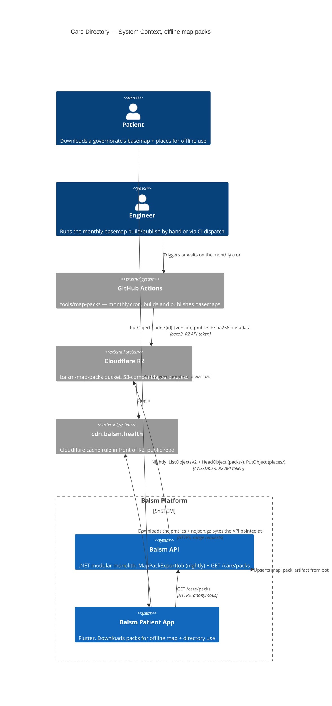

# Care Directory — Level 1: System Context, offline map packs

A second, independent external integration inside the same module as
[context.md](./context.md): Cloudflare R2, the object store the offline map
packs (basemap `.pmtiles` + places `.ndjson.gz`) live on. `GET /care/packs`
never talks to R2 — it reads `map_pack_artifact`, a table two different
writers keep in sync with what is actually on the bucket.

## Trust boundary: two writers, one reader, no runtime coupling between them

CI's `publish.py` and the API's `MapPackExportJob` both hold an R2 API token
and both write to the same bucket, but neither knows the other exists —
there is no webhook, no shared queue, no direct call in either direction.
`GET /care/packs` never touches R2 or CI: it reads a Postgres/SQLite table,
which is the only thing that makes the endpoint cheap, cacheable, and unable
to advertise a file that was never actually uploaded (see
[dynamic-map-pack-export.md](./dynamic-map-pack-export.md) for why).

**Basemaps are reconciled, not pushed.** CI has no database credentials by
design — a leaked CI secret should not be a path to the app's database. So
the API's nightly job lists `packs/` itself and upserts what it finds. A
basemap uploaded by CI is invisible to the app until the next nightly run
picks it up (worst case: just under 24h lag, accepted because basemaps
already rebuild on a monthly cadence).

**Places are exported, not synced.** The nightly job is the only writer of
`places/*.ndjson.gz` — there is no separate CI path for places at all. It
reads `care_place` directly (same database, same module, no network) and is
the only step in this diagram that touches PHI-adjacent policy: `CarePlace`
rows are the non-PHI public directory (see
[context.md](./context.md)), and the snapshot exports only the same public
fields `GET /care/entities` already returns.

## Two R2 tokens, two blast radii

CI's token (`R2_ACCOUNT_ID`/`R2_ACCESS_KEY_ID`/`R2_SECRET_ACCESS_KEY`/
`R2_BUCKET`, already a GitHub secret) and the API's token are deliberately
separate credentials scoped to Object Read & Write on `balsm-map-packs`
only — no cache-purge, no account-wide access. A compromised API host leaks
write access to one bucket, never the Cloudflare account, and never the
GitHub Actions secret store.

## Failure modes

| failure | behaviour |
|---|---|
| R2 credentials unset on the API host | nightly job logs a warning and returns; catalogue stays whatever it already was |
| `data/map-packs/governorates.json` missing | nightly job logs a warning and returns; no partial run |
| R2 unreachable mid-run | that governorate's exception is caught and logged; the other 26 still run (see dynamic diagram) |
| CI's monthly basemap build fails | no new `packs/` key appears; the API keeps serving the last version it reconciled |
