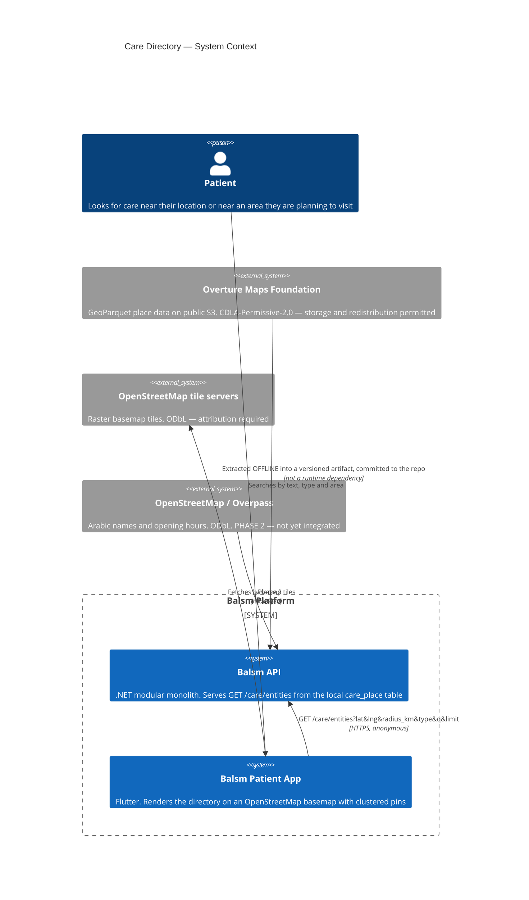

# Care Directory — Level 1: System Context

The care directory is the patient app's "nearby health places" map: hospitals,
clinics, dentists, pharmacies, labs, scan centres and medical stores. It is
**public reference data, not PHI**, and it is the only Balsm dataset sourced from
a third party rather than produced by users or providers.

## Trust boundaries and why the extract is offline

**The API never talks to S3 or Overpass at runtime.** Extraction happens by hand
into `data/care-directory/care_places.eg.ndjson.gz`, which is committed. Three
consequences, all deliberate:

- CI and the build need no network access to a third-party host.
- The exact bytes that populated production are auditable and re-playable — the
  manifest records the Overture release, row count and sha256.
- A third-party outage or a schema change upstream cannot break a deploy.

**Anonymous by design.** `GET /care/entities` is the one care endpoint marked
`[AllowAnonymous]` alongside the module health probe. The directory is public
business information; requiring a session would leak *who is looking for what
kind of care*, which is the PHI-adjacent signal worth protecting here.

**No PHI crosses this boundary in either direction.** The query carries a
location, which is why the endpoint takes coordinates as parameters rather than
resolving them from a session.

## Why Google Maps is not on this diagram

Google Maps Platform Terms §3.2.4(a) bar extraction, §3.2.3(b) bar storing Places
content beyond `place_id`, and §3.2.4(e) bar displaying Google content on a
non-Google map — which the OpenStreetMap basemap is. Separately, scraped rows
carry no provenance, and "where did your provider directory come from?" is a
question partner and regulatory due diligence will ask.

Overture carries per-row `sources` and a `confidence` score. That is the answer.

## Licence obligations this creates

| source | licence | obligation |
|---|---|---|
| Overture Places | CDLA-Permissive-2.0 | Attribution: © Overture Maps Foundation. Storage and redistribution permitted, no share-alike. |
| OSM tiles | ODbL | Attribution: © OpenStreetMap contributors, on the map surface. |
| OSM place data (Phase 2) | ODbL | Merging makes `care_place` a Derived Database. Serving query results is a *Produced Work* — attribution suffices; distributing the table would trigger share-alike. |
