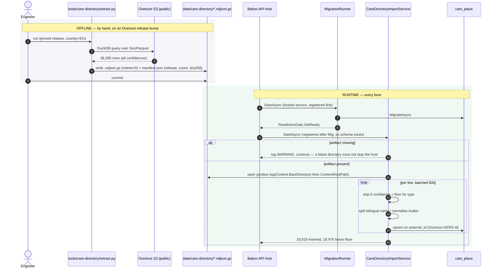

# Care Directory — Level 4: Dynamic, artifact import on startup

How ~19k Egyptian health places reach `care_place`, from a public S3 bucket to a
row a patient can call.

## Decisions this sequence encodes

**Hosted service, not a CLI.** The directory ships inside a self-hosted
deployment. An operator who never ran an import command would be left with a
blank map and no obvious cause, so the import follows `MigrationRunner`'s
pattern and runs itself.

**Registration order is load-bearing.** Hosted services start in registration
order. `MigrationRunner` is registered in `Balsm.Infrastructure`, the importer in
`AddCareDirectoryInfrastructure` which runs after — so the schema exists before
the first insert.

**Both roots are probed for the artifact.** `<Content>` copies to the *build
output* directory, which is where a published deployment runs from; under
`dotnet run` the content root is the project directory instead. Resolving from
only one silently finds nothing in development.

**Upsert on the GERS id, not on name or coordinates.** A re-import refreshes in
place and never duplicates, and `Id`/`CreatedAt` survive it. That stability is
what curated overrides and user corrections will key to in Phases 3–4.

**Every row is extracted, the floor is applied at import.** Confidence is
configuration (`CareDirectory:MinConfidence`, with per-type overrides), so it can
be retuned without re-extracting.

## Failure modes

| failure | behaviour |
|---|---|
| artifact missing | WARNING, host starts, directory empty |
| artifact corrupt / unparseable line | exception caught, ERROR logged, host stays up |
| import slower than boot | host reports ready before the import finishes; the map is briefly sparse, never wrong |
| re-import of identical data | all rows counted as updated, none inserted, no duplicates |
