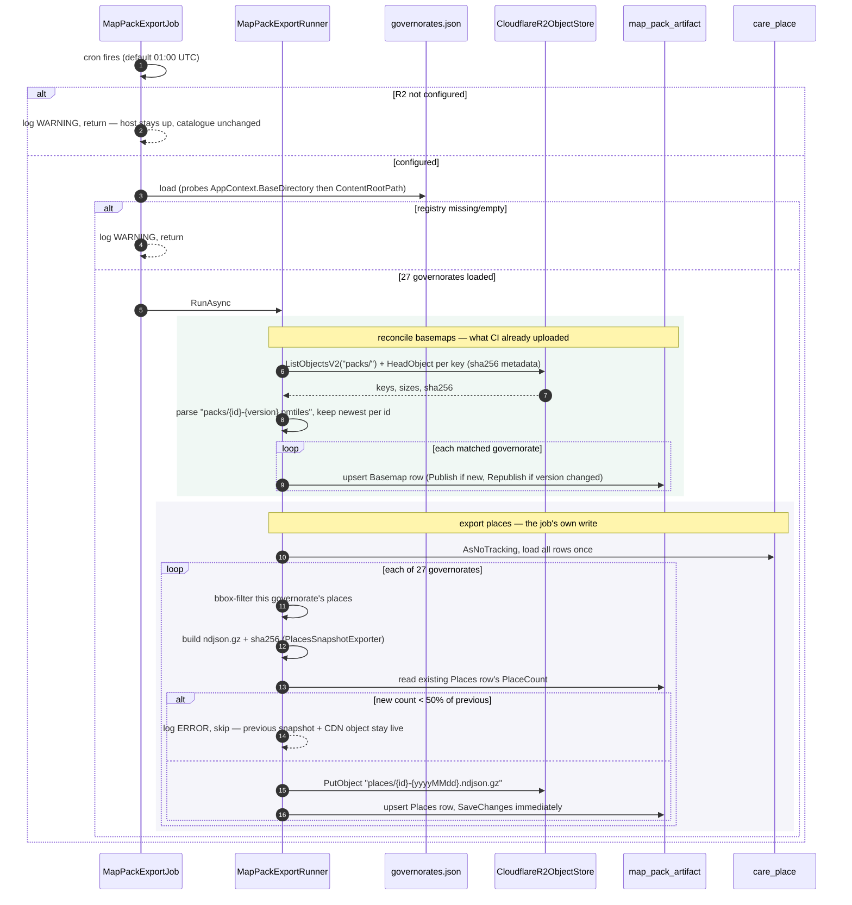

# Care Directory — Level 4: Dynamic, nightly map-pack export

One run of `MapPackExportJob`, from the cron tick to a governorate becoming
downloadable (or staying exactly as it was).

## Decisions this sequence encodes

**Basemap reconciliation and places export are two different trust
relationships to the same table**, covered in
[context-map-packs.md](./context-map-packs.md#trust-boundary-two-writers-one-reader-no-runtime-coupling-between-them):
one catches the manifest up to what CI already published, the other is the
job's own export. They run in the same method for scheduling convenience
only — neither depends on the other's result.

**Places are loaded once, not once per governorate.** ~38k rows in memory is
cheap next to 27 separate filtered queries a night, and it is what lets the
bbox split (`GovernorateRef.Contains`) be a pure, unit-tested function rather
than 27 EF translations of the same predicate.

**The guard compares against the row already in the table, not against
yesterday's file.** `ExportGuard.ShouldPublish` only ever sees
`(previousCount, newCount)` — a governorate with no prior Places row always
publishes (there is nothing to have dropped from), which is what lets a
brand-new governorate onboard on its first night rather than being
permanently refused for having "0 previous places."

**SaveChanges runs after every governorate, not once at the end.** A
transient R2 or DB failure on governorate 15 must not roll back the 14 that
already succeeded and already have real bytes sitting on the CDN — a
half-finished run should leave "some governorates refreshed tonight," never
"none did."

**A refused snapshot is silent to the app.** `GET /care/packs` still returns
the previous Places row — same version, same URL, same count — because
nothing in the table changed. The only visible trace of a refusal is the
ERROR log; there is no user-facing "export failed" state, on purpose: a
patient looking for offline packs should see yesterday's good data, not a
warning about a job they've never heard of.

## Failure modes

| failure | behaviour |
|---|---|
| a basemap key has no `sha256` metadata | that key is skipped with a WARNING — it was not written by `publish.py` and could not be verified on download anyway |
| a governorate's new place count is a large drop from its last snapshot | that governorate is skipped for the night; every other governorate still runs; previous snapshot stays advertised |
| R2 `PutObject` throws for one governorate | caught, logged, next governorate proceeds — see the per-governorate `try/catch` in `MapPackExportRunner.ExportPlacesAsync` |
| the whole run throws before reaching the loop (e.g. `ListObjectsV2` fails) | caught by `MapPackExportJob`'s outer handler; logged; the next cron tick tries again |
| host restarts mid-run | no partial-run bookkeeping — governorates already `SaveChanges`d keep their update, the rest wait for the next scheduled run |
