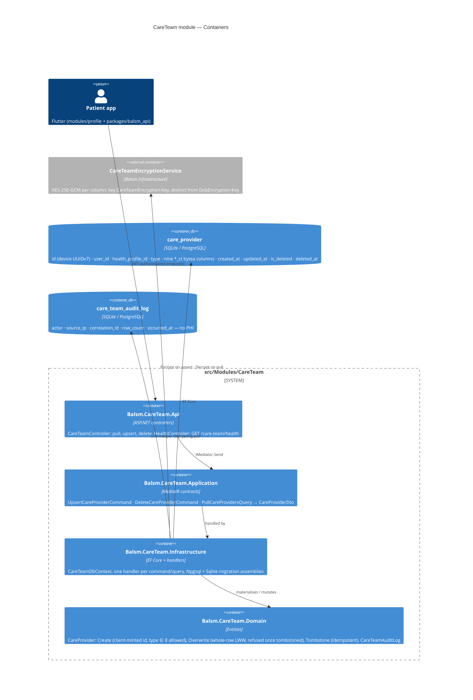

# Care Team — Level 2: Container

The module follows the standard four-project layout; handlers that touch the
DbContext live in Infrastructure (repo rule: no Application→EF dependency).

Field encryption is **not** a module concern — it reuses
`Balsm.Infrastructure/Encryption/CareTeamEncryptionService`, sitting alongside
`DobEncryptionService`, so the key material and the AES-GCM envelope format
live in one place for both cloud-PHI fields.

## Contract notes

- Responses use the platform envelope `{ data, error }` with snake_case keys
  (`health_profile_id`, `map_url`, `created_at`, `updated_at`, `is_deleted`).
- **The id is the client's.** `CareProviderId` is a device-minted UUIDv7 and is
  the primary key on both sides — no server assignment, no remapping on sync.
  Upsert is idempotent on it, so an at-least-once outbox drain cannot duplicate.
- **`updated_at` is the server's.** The client's `created_at` is carried through
  for first-write ordering only; `BaseDbContext.SetAuditFields` stamps
  `updated_at` from the server clock, so a device with a skewed clock cannot
  freeze a row by winning every last-writer-wins comparison.
- **Tombstones, not deletes.** `DELETE` soft-deletes via `BaseEntity.IsDeleted`.
  `BaseDbContext` auto-applies an `IsDeleted == false` query filter, so the pull
  handler calls `IgnoreQueryFilters()` deliberately — a delete on one device must
  propagate to the others, not merely vanish from the result set. Upsert also
  ignores filters, so a tombstoned id is found and refused (`409`) rather than
  silently re-created under the same primary key.
- **The pull is incremental** on `?since=` against `updated_at`, ordered
  ascending, filtered by `user_id` AND `health_profile_id`.
- Account deletion hard-deletes both tables for that `user_id`, tombstones
  included — `DeletionPurgeJob` resolves `CareTeamDbContext` alongside the
  others (FR-512).
- Insomnia collection: `docs/api/insomnia/care-team.yaml`. OpenAPI:
  `docs/api/openapi/v1/all.json`.
