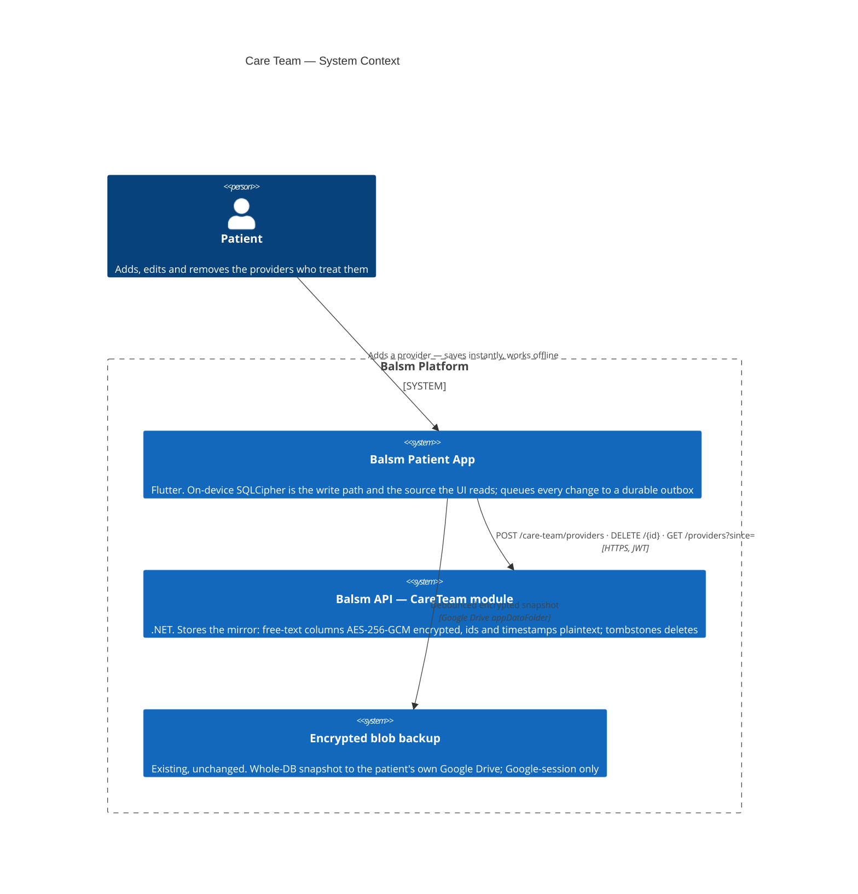

# Care Team — Level 1: System Context

The care team is the patient's own roster of the people and places that treat
them: their doctor, their pharmacy, the lab they use. Every field is
patient-entered free text — there is no directory to link against and nothing
is ever seeded.

Until now these rows lived **only** on the device (SQLCipher drift), with an
optional encrypted whole-database blob in the patient's *own* Google Drive.
That blob is unavailable to anyone who signed up with email OTP or Apple —
`DriveBackupAdapter` needs a Google session — so for those patients a lost
phone meant a lost care team. This module mirrors the rows to Balsm's own
database so the roster survives device loss for everyone.

> **This changes the platform's PHI posture.** ADR-10 ("PHI never on Supabase")
> and `Balsm-Core/architecture/bounded-contexts/personal-health.md` previously
> allowed exactly one cloud PHI field — `date_of_birth`. Care team is the
> second. The amendment, its rationale, and the controls that bound it are
> specified in `Balsm-Core/specs/003-care-team-cloud-sync/spec.md` (FR-502,
> FR-504, FR-511, FR-512, FR-514).

## Trust boundaries

- **Balsm can read this PHI.** Unlike the emergency QR — where the key never
  leaves the device and a database dump yields only ciphertext — the care-team
  key lives server-side (`CareTeamEncryption:Key`). Encryption at rest defends
  against a stolen dump or backup, **not** against Balsm itself or anyone who
  holds the key. That is the deliberate cost of a roster that restores without
  the patient retaining a recovery code.
- **A separate key from DOB.** `CareTeamEncryption:Key` is distinct from
  `DobEncryption:Key`, so rotating or compromising one does not reach the other.
- **Every decryption is attributable.** A pull that decrypts rows writes one
  `care_team_audit_log` row — actor, source IP, correlation id, row count —
  mirroring the FR-048 pattern for DOB. The audit row holds no PHI itself.
- **Local stays authoritative.** The cloud is a mirror, never the write path
  (ADR-11). Adding a provider with no signal must succeed; nothing in the UI
  path blocks on the network.
- **Ownership cannot be probed.** An id belonging to another user answers `404`,
  never `403` — unknown and not-owned are one response.
- **Scoped per health profile.** Queries filter on `user_id` AND
  `health_profile_id`, so a dependant's roster cannot leak into the self
  profile's list.
- **Attachments do not cross.** `care_provider_file` rows point at vault-relative
  paths whose bytes live in the patient's encrypted file store. They are **not**
  synced — a restored device shows the provider with no attachments rather than
  dangling references.
