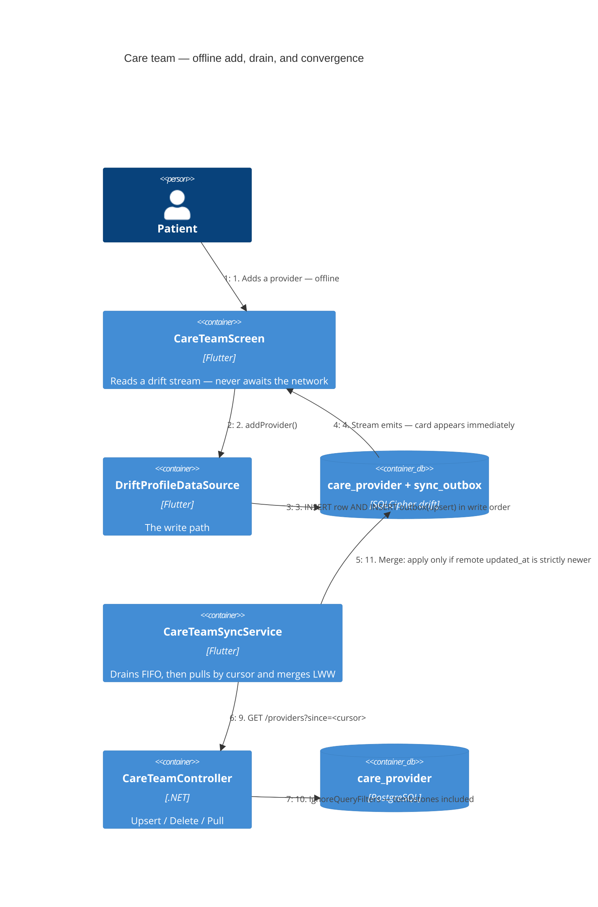

# Care Team — Level 4: Dynamic (offline edit → converged on both devices)

The flow that carries all the subtlety: a patient edits on a phone with no
signal, and the change reaches the server and a second device without ever
resurrecting something they deleted or clobbering a newer edit.

Push always precedes pull in one `sync()` pass. Pulling first would let the
server's copy of a row overwrite the local edit that is still sitting in the
outbox waiting to be sent.

## Why each guard exists

**Drain is FIFO and stops at the first failure.** The outbox is ordered by
rowid across the whole queue. If an `upsert` fails and the service skipped
ahead to the `delete` queued behind it for the same id, the server would
tombstone a row it never created, and the next pull would carry that tombstone
back — deleting a provider the patient still has. Stopping preserves the order
that makes upsert-then-delete safe.

**Merge writes bypass the outbox.** `_merge` writes straight to drift. Routing
a pulled row through `DriftProfileDataSource` would enqueue an outbound upsert
for a row that just came *from* the server, and the two would push each other
forever.

**Strictly newer wins.** Equal timestamps leave the local row untouched, so a
re-pull of rows already applied is a no-op rather than a rewrite.

**Tombstones are applied, not pushed.** A device offline for weeks holds a live
local row the server has tombstoned. Its drain re-uploads that row — and the
server answers `409 CareTeam.Tombstoned` rather than resurrecting it. The
device then pulls the tombstone and deletes locally.

## Cross-module: account deletion

`DeletionPurgeJob` (Deletion module) resolves `CareTeamDbContext` directly in
its per-user purge loop and hard-deletes both `care_provider` and
`care_team_audit_log` for that `user_id`, `IgnoreQueryFilters()` so tombstoned
rows go too. The job hardcodes each context — there is no purge-participant
abstraction — so **every new module holding user data must be added there**, or
its rows survive an account deletion.
