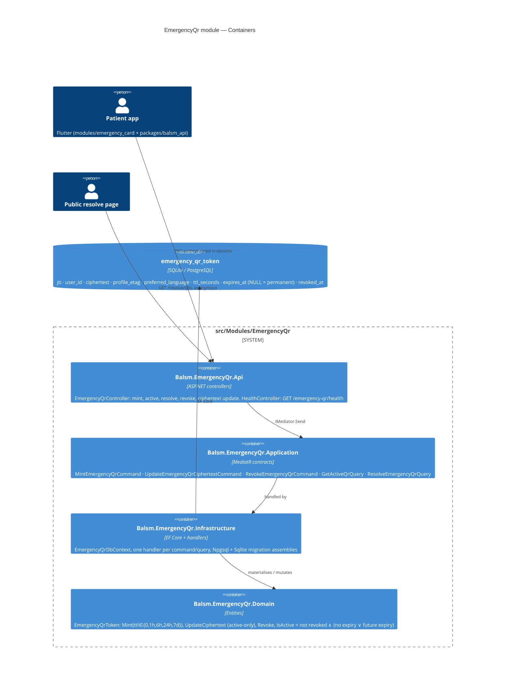

# Emergency QR — Level 2: Container

The module follows the standard four-project layout; handlers that touch the
DbContext live in Infrastructure (repo rule: no Application→EF dependency).

## Contract notes

- Responses use the platform envelope `{ data, error }` with snake_case keys
  (`token_id`, `expires_at`, `ciphertext`, `preferred_language`, `ttl_seconds`).
  `expires_at` is `null` for permanent tokens — clients must treat it as
  nullable everywhere.
- `profile_etag` (≤ 8 chars) is a client-computed fingerprint of the snapshot;
  the server stores it opaquely. It exists so the app can tell whether the
  ciphertext it last pushed still matches the on-device profile.
- Insomnia collection: `docs/api/insomnia/emergency-qr.yaml`. OpenAPI:
  `docs/api/openapi/v1/all.json`.
