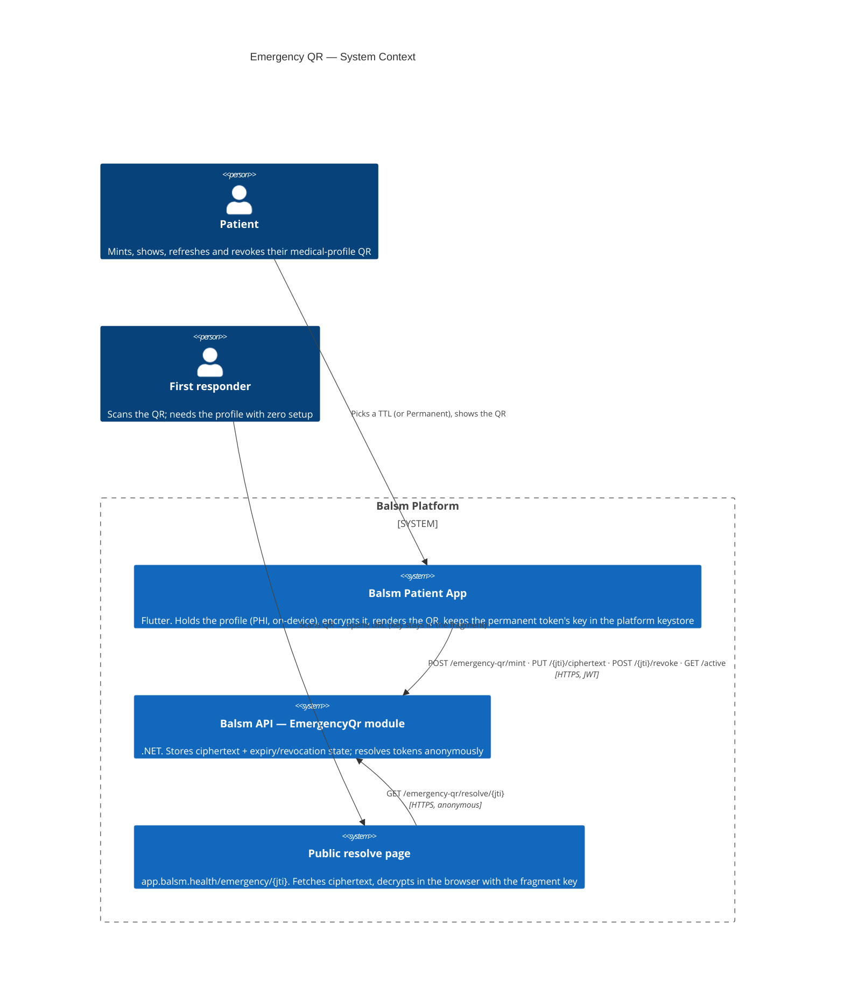

# Emergency QR — Level 1: System Context

The emergency QR is the patient's shareable medical profile: blood type,
allergies, conditions, and an emergency contact, encrypted **on the device**
and rendered as a QR code a first responder can scan. The server stores and
serves only ciphertext; the AES-256-GCM key travels exclusively inside the QR
URL's fragment (`#k=…`), which browsers never send over the network.

Tokens come in two kinds:

- **Temporary** (1h / 6h / 24h / 7d): expire automatically, countdown shown.
- **Permanent** (`ttl_seconds = 0`): never expires, and its URL never changes —
  the app silently replaces the ciphertext in place when the profile changes,
  so an old printout still resolves to current data. It is also the patient's
  **stable profile identity token** (booking / emergency / delegation flows
  bind to its jti), mints without any health data, and mints **offline** —
  the jti is client-generated and synced to the server later.

## Trust boundaries

- **The key never reaches Balsm.** Encryption and decryption are client-side;
  the fragment is not part of the HTTP request. A Balsm database dump yields
  ciphertext only.
- **Resolve is anonymous by design** — a responder cannot be asked to log in.
  The token id (a GUID) is the capability; revoked, expired, and unknown tokens all return a uniform `404` (spec v2.0) so existence cannot be probed.
- **One active token per user.** Minting revokes any prior token server-side,
  so a lost QR is invalidated by minting a new one (or by explicit revoke).
- **Permanent tokens shift the risk from staleness to persistence**: the QR
  works forever until revoked, so the revoke action stays one tap away in the
  share sheet, and the key is held in the platform keystore, not app storage.
