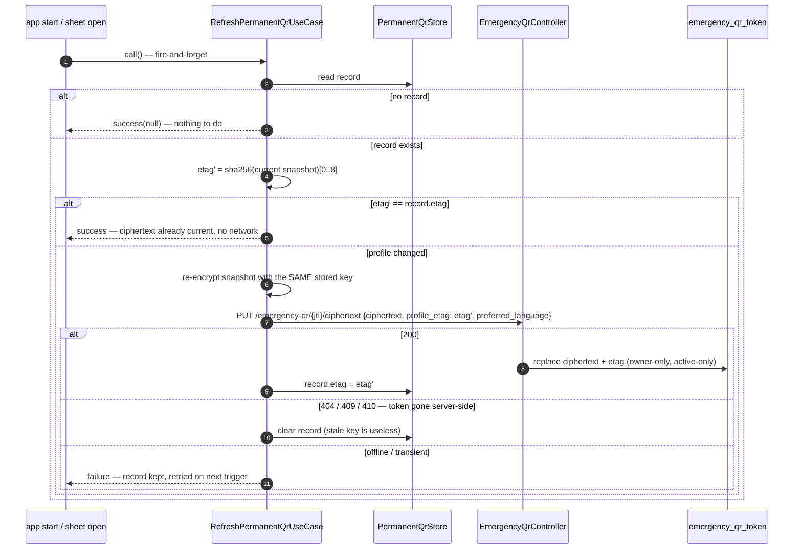

# Emergency QR — Level 4: Dynamic, permanent-QR lifetime

The property being preserved: **the QR image printed on day 1 must resolve to
the profile as it is on day N**, without the key ever leaving the device.

## Mint (ttl = 0) — offline-first

The jti is generated **on-device** (CSPRNG UUIDv4), so the QR renders, shares
and saves with no connectivity. The server learns about the token when the
sync lands: mint is idempotent per client-supplied `token_id`.

```mermaid
sequenceDiagram
  autonumber
  participant Sheet as _QrShareSheet (app)
  participant UC as MintEmergencyQrTokenUseCase
  participant KS as PermanentQrStore (keystore)
  participant API as EmergencyQrController
  participant Db as emergency_qr_token

  Sheet->>UC: call(ttlSeconds: 0, preferredLanguage)
  UC->>UC: snapshot (may be EMPTY — identity token) ; generate AES key + jti (UUIDv4)
  UC->>UC: encrypt snapshot → nonce‖ciphertext‖mac; etag = sha256(snapshot)[0..8]
  UC-->>Sheet: MintResult immediately (qrUrl = …/emergency/{jti}#k={key})
  UC->>API: POST /emergency-qr/mint {…, ttl_seconds: 0, token_id: jti} — best-effort
  alt online
    API->>Db: revoke prior active; upsert token (idempotent per token_id)
    UC->>KS: write {jti, key, etag, synced: true}
  else offline
    UC->>KS: write {jti, key, etag, synced: false}
    note over KS: refresh use case retries the sync (app start + sheet open)
  end
```

## Silent refresh (app start · sheet open)



## Failure modes considered

| Failure | Behaviour |
|---|---|
| Minted offline, never synced | QR renders/shares locally; public resolve 404s until the idempotent mint lands on a later trigger. |
| Revoke of a never-synced token | Server 404 is treated as success — deleting the local key kills the QR. |
| Device offline at refresh | Old ciphertext keeps resolving (stale but valid); retry on next trigger. |
| Token revoked from another device | `PUT` returns 410 → local record cleared; sheet falls back to the mint affordance. |
| Keystore record corrupted | `PermanentQrStore.read()` drops it and returns null — never crashes the sheet. |
| Temporary token minted afterwards | Server revokes the permanent token; the app clears the stored key in the same flow. |
| Profile emptied | Refresh is a no-op — leaving vs. revoking an emptied profile is the patient's decision, not the sync job's. |
